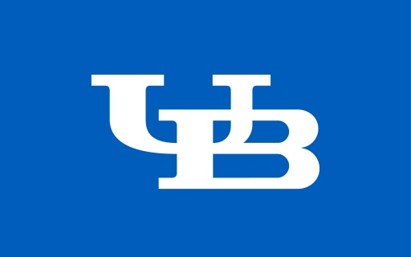
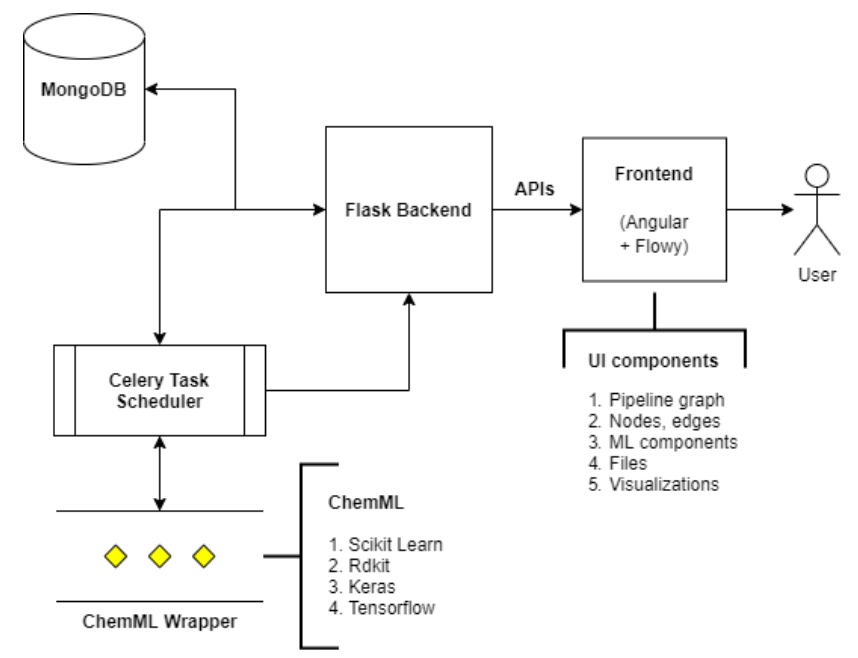

# [Made@UB](https://madeatub.buffalo.edu/news/49-machine-learning-toolkit-news) - Machine Learning Toolkit


ML Toolkit provides an online web interface for designing Machine Learning (ML) models, by effectively eliminating the requirement of  in-depth programming knowledge. 

With the new web UI for ML Toolkit the user can visualize a machine learning pipeline with an easy to use drag-and-drop option.

**ML toolkit can be used as:**

1. **Pedagogical Tool:** This tool could streamline the process of explaining complex machine learning algorithms,by using the visualisation feature . This will help bridge the gap between coherent and correct understanding of machine learning concepts and fragmented knowledge of the subject. The user friendly drag-and-drop functionality will enable a hands on approach to learning by allowing students to quickly test their understanding by building machine learning pipelines 
2. **Rapid Prototyping Research Tool:** This tool will be used for hypothesis testing in different research domains. It can be used to replicate results from research papers where some machine learning technique has been employed. 

## ML Toolkit Technology stack:

At its very core ML toolkit is built over ChemML which is a machine learning and informatics program suite for the analysis, mining, and modeling of chemical and materials data. ChemML uses modules from popular third party machine learning packages: scikit-learn, keras and tensorflow. Modules for organic/inorganic data come from RDKit, Dragon and Magpie.

The web toolkit’s backend is built over python, flask, django, mongoDB and celery. The frontend is built over the Angular 8 framework. To develop flowchart functionality with flexibility required in our use-case, we made changes to an open source library called flowy JS which is used to create elegant graphs.

The current implementation will support creation of user defined data flows with multiples runs. The user is just required to drag and drop the components required in the ML pipeline, configure those components and their respective dependencies and hit run. The backend will schedule the ML pipeline runs and the results will be returned to the user.

**Current Features of ML Toolkit:**

1. **Datasets:** Import data from CSV or chemML’s inbuilt chemical and material sciences datasets.
Represent and Prepare: Perform PCA, factor analysis, scaling and data splitting.
2. **Models and Model Optimization:** Train linear models, support vector machines, and neural networks for regression and classification tasks. Search for the right set of model parameters using GridSearchCV, filter models based on various metrics like MAE or R2 Score.
3. **Results:** See the output of various runs of the pipeline and compare them based on the results.
Save Project and associated files: A project consists of the user created pipeline, associated files that the user has uploaded like research paper, datasets etc. and  the multiple runs of the pipeline along with their respective results.
4. **Visualization:** ChemML will allow users to visualize the outputs from the pipeline so as to support easy comparison of various runs. Users can also get certain intermediate outputs from the pipeline.

## Run the code locally:


**Requirements:**
1. Celery
2. Node JS
3. Angular CLI
4. Python 3.6
5. Flask
   

**Clone the project**
```
git clone https://github.com/bhavinjawade/MLToolkit.git
```

**Run Angular**
```
cd client/chemmlAngular
npm install
ng serve
```

**Run flask**
```
cd server/api
python api.py
```

**Run celery**
```
celery -A celery_task worker --loglevel=info --pool=eventlet
```

**References:**
1. **FlowyJS:** https://github.com/alyssaxuu/flowy
2. **ChemML:** https://github.com/hachmannlab/chemml