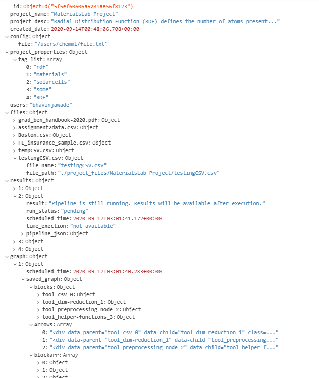

# Project Documentation

> **Version:** 1.1.0 \
> **Project Repo:** https://github.com/bhavinjawade/ChemML_Web_UI \
> **Last Revision to documentation:** 23rd October 2020 \
> **Chemml_Repo:** https://github.com/hachmannlab/chemml/tree/wrapper_aatish

**Folder Structure:**

- server
  - api
    - api.py
  - chemml
- client
  - chemmlAngular
    - src
      - app
        - left-files-bar-component 
        - left-menu-component 
        - loading-component 
        - nav-button 
        - new-project-box 
        - open-project 
        - project-info-component 
        - results-page-component 
        - global-footer              
        - toolbox 
        - helpers                          
        - toolbox-component 
        - home-page                        
        - tool-config 
        - input-output-config              
        - visualize-main
        - landing-page
      - assets
      - environments
- docs
- arch.PNG
- deployment.md
- deployment.pdf
- README.md
- ub_logo.jpg

## Architecture

**Database structure:**

*MongoDB Collections > chemml_projects > projects*



## Code Structure

**To add a new API**
___
1. Create a app.route and associated function in **server/api/api.py**.
2. Add API path in **app/helpers/api_url.ts**.
3. Add an Observable function in **data-service.service.ts**.
4. Subscribe to the observable in the component's constructor.

*Example Function*

```js
runPipeline(project_name: string, body: any): Observable<any> {
    var packet:any = {
      data : body
    }
    return this.http.post(API_URLS.runPipeline+project_name,
      JSON.stringify(packet)).pipe(
      catchError(this.handleError<any>('runPipeline', []))
    );
  }
```


**Angular Components:**
___

1. **global-footer:** add it to every full page component.
2. **helpers:** contains chemml-sklearn-jsons, and api_url.ts
3. **home-page:** the main-landing page. contains redirection to tutorials and portal.
4. **input-output-component:** Opens when the user clicks on the arrows between tab. Handles output from previous node and input to next node.
5. **landing-page:** This is main page of the portal. Shows the listing of all projects.
6. **left-files-bar-components:** Show and upload files to the project.
7. **left-menu-components:** Not of any use. To be deleted.
8. **loading-component:** Import this component to create a loader in between component.
9.  **nav-button:** Edit the navbar buttons in this component.
10. **new-project-box:** Opens the new project box.
11. **open-project:** Loads all the previous project. 
12. **project-info-component:** Edit the project information name, description, and tags.
13. **results-page-component:** This component displays all the results of previous runs.
14. **tool-config:** Side config bar, to select configuration options for selected tool. Contains the json interpolator. 
15. **toolbox:** left side toolbox that lists all tools
16. **toolbox-component:** Component that creates individuals tools. This works with flowy.js drag and drop.
17. **visualize-main:** The visualization component. Add more graphs in this component.
18. **app.component.ts**: The main component where portal canvas and drag drop functionalities work.


> Celery pipeline uses mongoDB backend. **Mongodb > jobs collection**.

> Description for individual functions will be added as comments in code files.

## Project Deployment

**Backend:** 
___
1. Clone repository:

```js
https://github.com/bhavinjawade/ChemML_Web_UI
```

2. Activating environment and setting up flask API. The api code package requirements are written in requirements.txt

```cmd
conda activate ./my_chemml_env
cd server
cd api
pip3 install requirements.txt

```

3. Install chemml

```cmd
cd ..
cd chemml
pip3 install -e .
```

4. Start API Server
```python
python api.py &
```

4. Setup Celery and MongoDB. 

> MongoDB is both our application database and celery backend and broker.

> Celeryconfig is alreay written in a file called celeryconfig.py. So the next steps are to install mongoDB and install celery and create celery worker process.

If MongoDB and celery are installed, then run:

```
celery -A celery_task worker --loglevel=info --pool=eventlet
```

To install celery:

```
pip3 install celery
```

To install mongoDB community via terminal:

```
wget -qO - https://www.mongodb.org/static/pgp/server-4.4.asc | sudo apt-key add -
```
```
echo "deb [ arch=amd64,arm64 ] https://repo.mongodb.org/apt/ubuntu focal/mongodb-org/4.4 multiverse" | sudo tee /etc/apt/sources.list.d/mongodb-org-4.4.list

```
```
sudo apt-get update
```
```
sudo apt-get install -y mongodb-org
```

Start mongoDB server:

`
sudo systemctl start mongod
`

**Frontend**
___
Create production build of angular project.

```
cd client
cd chemmlAngular
ng build --prod
```

This will create the production build in dist folder. 

> Make sure angular.json baseURL is set to point right url for static files.